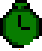
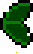
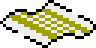

There are $40 different values for 'entity type'. For each entity type, there is a jump table address located in a table at address $8B0E, and a control byte in a table located at address $8B8E.

The meanings of each entity type are as follows:

|ID|AI addr|Ctrl|?|JumpOn|?|?|TVel|Nmnc|AI|Description|Image|
|01|96F8|24|0|0|1|0|4|RATL|SNEK|Player one snake head||
|02|96F8|24|0|0|1|0|4|ROLL|    |Player two snake head||
|05|D302|84|1|0|0|0|4|TAIL|TAIL|Snake tail segment||
|1B|C048|84|1|0|0|0|4|PAIN|PAIN|Snake tail segment floating away||
|31|AFEA|A4|1|0|1|0|4|PBLY|PBLY|Nibbly Pibbly||
|32|AFEA|04|0|0|0|0|4|PJMP|PBLY|Pibbleboing||
|06|AFCA|24|0|0|1|0|4|PJOG|PJOG|Pibblejogger (transmutes into other pibble types on other levels)||
|09|B272|24|0|0|1|0|4|PGOO|PGOO|Pibblesplat||
|0C|AFEA|21|0|0|1|0|1|PBAT|PBLY|Pibblebat||
|30|CC4B|02|0|0|0|0|2|FISH|FISH|Pibblefish, swimming or as part of exit splash||
|33|AFEA|04|0|0|0|0|4|HELI|PBLY|Pibblecopter||
|29|CB48|82|1|0|0|0|2|SPIT|SPIT|Spit-out pibbley chunk||
|2A|CB87|81|1|0|0|0|1|WING|WING|Spit-out pibblebat wing||
|21|C1F9|02|0|0|0|0|2|PDSP|PDSP|Nibbly Pibbly dispenser||
|07|B4A6|A4|1|0|1|0|4|DPBL|DPBL|Nibbly Pibbly being ejected from a dispenser||
|3C|CC2C|84|1|0|0|0|4|PEGG|PEGG|Pibblefish egg||
|2F|CBBD|FF|1|1|1|1|F|WEED|WEED|Pond seaweed||
|16|BB5D|24|0|0|1|0|4|BOMB|BOMB|Bomb||
|17|BDAF|04|0|0|0|0|4|BANG|BANG|Explosion (from bomb)||
|24|BDAF|02|0|0|0|0|2|EBNG|BANG|Explosion (from enemy)||
|18|BE37|94|1|0|0|1|4|FLAK|FLAK|Explosion shrapnel||
|1C|C0B5|04|0|0|0|0|4|TIME|DROP|Clock dropped item||
|1D|C0B5|02|0|0|0|0|2|DMND|DROP|Diamond dropped item, tail fin||
|1F|C0B5|02|0|0|0|0|2|RVRS|DROP|Reverse dropped item (not present in data)||
|20|C0B5|02|0|0|0|0|2|FSTR|DROP|Speed Up dropped item||
|1E|C0B5|02|0|0|0|0|2|LIFE|DROP|Extra life dropped item||
|2B|C0B5|03|0|0|0|0|3|DETH|DROP|Fake extra life dropped item||
|34|C634|04|0|0|0|0|4|ITEM|ITEM|Bonus item pick-up||
|11|B907|32|0|0|1|1|2|JAWS|JAWS|Shark on levels 1 and 2||
|0D|B6E5|00|0|0|0|0|0|DOZR|DOZR|Snakedozer||
|0E|B759|11|0|0|0|1|1|RAZR|RAZR|Bladez||
|14|BA7F|10|0|0|0|1|0|CSHN|CSHN|Pin cushion||
|15|BB14|A4|1|0|1|0|4|PINN|PINN|Ejected cushion pin||
|2D|AE8C|01|0|0|0|0|1|BDSP|AE8C|Bell dispenser||
|19|C78B|08|0|0|0|0|8|DBEL|DBEL|Bell being ejected from a dispenser||
|36|C7C7|08|0|0|0|0|8|ANVL|ANVL|Anvilz||
|3A|9F1D|04|0|0|0|0|4|BALL|BALL|Beach ball/Snowball/Asteroid||
|38|B9D5|04|0|0|0|0|4|STRE|STRE|Still Metal Tree||
|13|B9D9|61|0|1|1|0|1|SLDR|SLDR|Krazy Seat/Ice cube||
|22|B986|62|0|1|1|0|2|SEAT|SEAT|Krazy Seat from lid||
|2C|B9B3|43|0|1|0|0|3|SPNR|SPNR|Krazy seat going in circles||
|35|C68A|44|0|1|0|0|4|PACR|PACR|Record/Mushroom/Bubble||
|3B|C68A|44|0|1|0|0|4|BELL|PACR|Hopping Bell||
|39|C68A|04|0|0|0|0|4|MTRE|PACR|Mobile metal Tree||
|1A|BE8E|24|0|0|1|0|4|FOOT|FOOT|Big Foot||
|10|B8CE|02|0|0|0|0|2|FLAG|FLAG|Icefoot's flag on level 11||
|0A|B5C0|04|0|0|0|0|4|DOOR|DOOR|Entrance/exit door||
|0B|B65A|21|0|0|1|0|1|SCAL|SCAL|Weigh-scale||
|25|C9B5|02|0|0|0|0|2|CRPT|CRPT|Magic carpet||
|37|9EA1|04|0|0|0|0|4|WJET|WJET|Water Jet||
|3D|0700|04|0|0|0|0|4|UFOB|UFOB|UFO (body)||
|3E|077C|04|0|0|0|0|4|UFOC|UFOC|UFO (canopy||
|3F|9E0B|1F|0|0|0|1|F|RCKT|RCKT|Warp rocket to level 8||
|28|CB2A|0F|0|0|0|0|F|SKOR|SKOR|Floating points value||
|08|AF3D|04|0|0|0|0|4|LIDD|LIDD|Flipping lid||
|0F|B88E|11|0|0|0|1|1|RIPL|RIPL|Water splash||
|12|B959|91|1|0|0|1|1|ARGG|ARGG|Letters for ARG||
|2E|CBA6|84|1|0|0|0|4|BUBL|BUBL|Underwarter snake breath||
|00|C8F6|00|0|0|0|0|0|NULL|NULL|No entity. Code is used for non-null entities caught in a black hole|
|23|C858|02|0|0|0|0|2|HOLE|HOLE|Black hole
|26|C1D7|02|0|0|0|0|2|XTRA|XTRA|Bonus stage context
|27|CAEB|02|0|0|0|0|2|TRAP|TRAP|BigFoot motion sensor
|03|96F8|24|0|0|1|0|4|||(Unused)|
|04|96F8|24|0|0|1|0|4|||(Unused)|