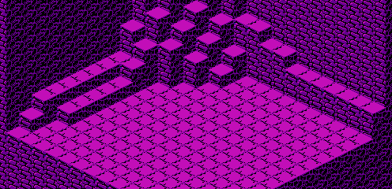

The map data for the first fish pond is stored in run-length encoding. The data is located starting at address 0678 of CHR ROM page 6:

	CHRROM6
	0678	81 01  90 0F  81 01  56 01
	0680	90 0E  81 01  61 01  90 0E
	0688	81 01  61 01  56 01  90 0D
	0690	81 01  61 01  56 01  90 0D
	0698	81 01  61 01  56 01  90 0D
	06A0	81 01  61 01  56 01  90 0D
	06A8	81 01  61 01  56 01  90 0D
	06B0	81 01  61 02  90 0D  81 01
	06B8	19 01  14 01  90 0D  81 01
	06C0	52 01  66 01  14 01  90 0C
	06C8	81 01  53 01  51 01  19 01
	06D0	61 01  90 0B  81 01  54 01
	06D8	52 01  66 01  14 01  56 01
	06E0	90 0A  81 01  65 02  53 01
	06E8	19 01  61 01  90 0A  81 01
	06F0	65 02  54 01  51 01  19 02
	06F8	14 02  61 07  81 10

It decompresses to the following arrangement:

	81 90 90 90 90 90 90 90 90 90 90 90 90 90 90 90
	81 56 90 90 90 90 90 90 90 90 90 90 90 90 90 90
	81 61 90 90 90 90 90 90 90 90 90 90 90 90 90 90
	81 61 56 90 90 90 90 90 90 90 90 90 90 90 90 90
	81 61 56 90 90 90 90 90 90 90 90 90 90 90 90 90
	81 61 56 90 90 90 90 90 90 90 90 90 90 90 90 90
	81 61 56 90 90 90 90 90 90 90 90 90 90 90 90 90
	81 61 56 90 90 90 90 90 90 90 90 90 90 90 90 90
	81 61 61 90 90 90 90 90 90 90 90 90 90 90 90 90
	81 19 14 90 90 90 90 90 90 90 90 90 90 90 90 90
	81 52 66 14 90 90 90 90 90 90 90 90 90 90 90 90
	81 53 51 19 61 90 90 90 90 90 90 90 90 90 90 90
	81 54 52 66 14 56 90 90 90 90 90 90 90 90 90 90
	81 65 65 53 19 61 90 90 90 90 90 90 90 90 90 90
	81 65 65 54 51 19 19 14 14 61 61 61 61 61 61 61
	81 81 81 81 81 81 81 81 81 81 81 81 81 81 81 81

It appears in-game as the following map:

[Previous](level_4_bonus_map.html)
[Next](fish_pond_2_map.html)
