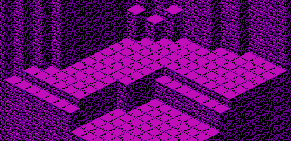

The map data for the second fish pond is stored in run-length encoding. The data is located starting at address 06FE of CHR ROM page 6:

	CHRROM6
	06FE	81 01	 61 07	 90 08	 81 01
	0706	55 01	 14 06	 90 08	 81 01
	070E	55 02	 14 05	 90 08	 81 01
	0716	55 03	 14 04	 90 08	 81 01
	071E	55 03	 14 04	 90 08	 81 01
	0726	55 03	 14 05	 90 07	 81 01
	072E	55 03	 14 05	 90 07	 81 01
	0736	55 03	 14 05	 90 07	 81 01
	073E	55 03	 14 05	 61 07	 81 01
	0746	55 03	 14 0C	 81 01	 55 03
	074E	51 01	 14 0B	 81 01	 55 03
	0756	53 01	 66 01	 14 0A	 81 01
	075E	55 04	 53 01	 51 01	 14 09
	0766	81 01	 55 09	 14 06	 81 01
	076E	55 0B	 14 04	 81 10

It decompresses to the following arrangement:

	81 61 61 61 61 61 61 61 90 90 90 90 90 90 90 90
	81 55 14 14 14 14 14 14 90 90 90 90 90 90 90 90
	81 55 55 14 14 14 14 14 90 90 90 90 90 90 90 90
	81 55 55 55 14 14 14 14 90 90 90 90 90 90 90 90
	81 55 55 55 14 14 14 14 90 90 90 90 90 90 90 90
	81 55 55 55 14 14 14 14 14 90 90 90 90 90 90 90
	81 55 55 55 14 14 14 14 14 90 90 90 90 90 90 90
	81 55 55 55 14 14 14 14 14 90 90 90 90 90 90 90
	81 55 55 55 14 14 14 14 14 61 61 61 61 61 61 61
	81 55 55 55 14 14 14 14 14 14 14 14 14 14 14 14
	81 55 55 55 51 14 14 14 14 14 14 14 14 14 14 14
	81 55 55 55 53 66 14 14 14 14 14 14 14 14 14 14
	81 55 55 55 55 53 51 14 14 14 14 14 14 14 14 14
	81 55 55 55 55 55 55 55 55 55 14 14 14 14 14 14
	81 55 55 55 55 55 55 55 55 55 55 55 14 14 14 14
	81 81 81 81 81 81 81 81 81 81 81 81 81 81 81 81

It appears in-game as the following map:

[Previous](fish_pond_1_map.html)
[Next](fish_pond_3_map.html)
