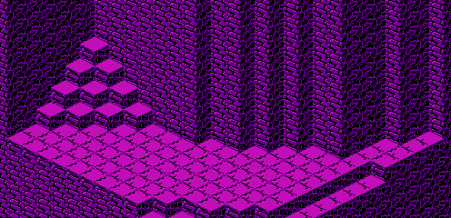

The map data for the third fish pond is stored in run-length encoding. The data is located starting at address 0774 of CHR ROM page 6:

	CHRROM6
	0774	81 01  56 09  90 06  81 01
	077C	56 0A  90 05  81 01  61 01
	0784	56 0B  90 03  81 01  14 01
	078C	61 01  56 0B  90 02  81 01
	0794	19 01  14 01  61 01  56 0B
	079C	90 01  81 01  66 01  19 01
	07A4	14 01  61 01  56 0A  90 01
	07AC	81 08  56 07  90 01  81 0A
	07B4	56 05  90 01  81 0B  56 04
	07BC	90 01  81 0C  56 03  90 01
	07C4	81 0E  56 01  90 01  81 0E
	07CC	56 02  81 0E  56 02  81 0F
	07D4	56 01  81 0F  56 01  81 10

It decompresses to the following arrangement:

	81 56 56 56 56 56 56 56 56 56 90 90 90 90 90 90
	81 56 56 56 56 56 56 56 56 56 56 90 90 90 90 90
	81 61 56 56 56 56 56 56 56 56 56 56 56 90 90 90
	81 14 61 56 56 56 56 56 56 56 56 56 56 56 90 90
	81 19 14 61 56 56 56 56 56 56 56 56 56 56 56 90
	81 66 19 14 61 56 56 56 56 56 56 56 56 56 56 90
	81 81 81 81 81 81 81 81 56 56 56 56 56 56 56 90
	81 81 81 81 81 81 81 81 81 81 56 56 56 56 56 90
	81 81 81 81 81 81 81 81 81 81 81 56 56 56 56 90
	81 81 81 81 81 81 81 81 81 81 81 81 56 56 56 90
	81 81 81 81 81 81 81 81 81 81 81 81 81 81 56 90
	81 81 81 81 81 81 81 81 81 81 81 81 81 81 56 56
	81 81 81 81 81 81 81 81 81 81 81 81 81 81 56 56
	81 81 81 81 81 81 81 81 81 81 81 81 81 81 81 56
	81 81 81 81 81 81 81 81 81 81 81 81 81 81 81 56
	81 81 81 81 81 81 81 81 81 81 81 81 81 81 81 81

It appears in-game as the following map:

[Previous](fish_pond_2_map.html)
[Next](fish_pond_4_5_map.html)
