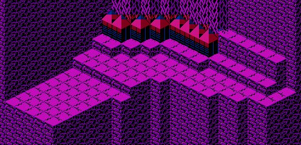

The map data for the fourth and fifth fish pond is stored in run-length encoding. The data is located starting at address 07DC of CHR ROM page 6:

	CHRROM6
	07DC	81 01  90 05  00 0A  81 01
	07E4	90 05  00 0A  81 01  90 05
	07EC	00 0A  81 01  90 05  00 0A
	07F4	81 01  90 05  00 0A  81 01
	07FC	90 05  00 0A  81 01  90 06
	0804	00 09  81 01  56 06  00 09
	080C	81 01  56 06  00 09  81 01
	0814	61 02  56 05  00 08  81 01
	081C	60 02  61 01  56 08  00 04
	0824	A9 03  60 01  61 01  56 09
	082C	00 02  A9 04  60 01  61 04
	0834	56 07  A9 05  60 04  61 06
	083C	56 01  A9 09  19 06  56 01
	0844	81 10

It decompresses to the following arrangement:

	81 90 90 90 90 90 00 00 00 00 00 00 00 00 00 00
	81 90 90 90 90 90 00 00 00 00 00 00 00 00 00 00
	81 90 90 90 90 90 00 00 00 00 00 00 00 00 00 00
	81 90 90 90 90 90 00 00 00 00 00 00 00 00 00 00
	81 90 90 90 90 90 00 00 00 00 00 00 00 00 00 00
	81 90 90 90 90 90 00 00 00 00 00 00 00 00 00 00
	81 90 90 90 90 90 90 00 00 00 00 00 00 00 00 00
	81 56 56 56 56 56 56 00 00 00 00 00 00 00 00 00
	81 56 56 56 56 56 56 00 00 00 00 00 00 00 00 00
	81 61 61 56 56 56 56 56 00 00 00 00 00 00 00 00
	81 60 60 61 56 56 56 56 56 56 56 56 00 00 00 00
	A9 A9 A9 60 61 56 56 56 56 56 56 56 56 56 00 00
	A9 A9 A9 A9 60 61 61 61 61 56 56 56 56 56 56 56
	A9 A9 A9 A9 A9 60 60 60 60 61 61 61 61 61 61 56
	A9 A9 A9 A9 A9 A9 A9 A9 A9 19 19 19 19 19 19 56
	81 81 81 81 81 81 81 81 81 81 81 81 81 81 81 81

It appears in-game as the following map:

[Previous](fish_pond_3_map.html)
