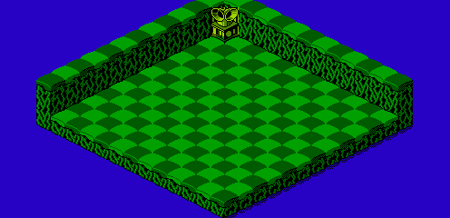

The map data for the bonus map of level 1 is stored in run-length encoding. The data is located starting at address 01DA of CHR ROM page 6:

	CHROM6
	01DA	00 21  3F 01  01 0C  00 03
	01E2	3F 01  01 0C  00 03  3F 01
	01EA	01 0C  00 03  3F 01  01 0C
	01F2	00 03  3F 01  01 0C  00 03
	01FA	3F 01  01 0C  00 03  3F 01
	0202	01 0C  00 03  3F 01  01 0C
	020A	00 03  3F 01  01 0C  00 03
	0212	3F 01  01 0C  00 03  3F 01
	021A	01 0C  00 03  3F 01  1E 01
	0222	01 0B  00 03  3F 0D  00 12

It decompresses to the following arrangement:

	00 00 00 00 00 00 00 00 00 00 00 00 00 00 00 00
	00 00 00 00 00 00 00 00 00 00 00 00 00 00 00 00
	00 3F 01 01 01 01 01 01 01 01 01 01 01 01 00 00
	00 3F 01 01 01 01 01 01 01 01 01 01 01 01 00 00
	00 3F 01 01 01 01 01 01 01 01 01 01 01 01 00 00
	00 3F 01 01 01 01 01 01 01 01 01 01 01 01 00 00
	00 3F 01 01 01 01 01 01 01 01 01 01 01 01 00 00
	00 3F 01 01 01 01 01 01 01 01 01 01 01 01 00 00
	00 3F 01 01 01 01 01 01 01 01 01 01 01 01 00 00
	00 3F 01 01 01 01 01 01 01 01 01 01 01 01 00 00
	00 3F 01 01 01 01 01 01 01 01 01 01 01 01 00 00
	00 3F 01 01 01 01 01 01 01 01 01 01 01 01 00 00
	00 3F 01 01 01 01 01 01 01 01 01 01 01 01 00 00
	00 3F 1E 01 01 01 01 01 01 01 01 01 01 01 00 00
	00 3F 3F 3F 3F 3F 3F 3F 3F 3F 3F 3F 3F 3F 00 00
	00 00 00 00 00 00 00 00 00 00 00 00 00 00 00 00

It appears in-game as the following map:

[Next](level_2_bonus_map.html)
