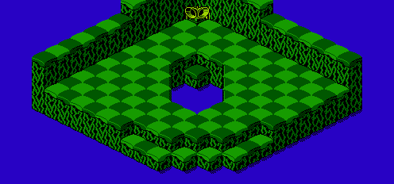

The map data for the bonus map of level 2 is stored in run-length encoding. The data is located starting at address 022A of CHR ROM page 6:

	CHRROM6
	022A	00 21  02 01  04 06  01 03
	0232	00 06  02 01  04 09  01 01
	023A	00 05  02 01  04 0A  01 01
	0242	00 04  02 01  04 0B  01 01
	024A	00 03  02 01  04 05  00 03
	0252	04 03  01 01  00 03  02 01
	025A	04 04  00 04  04 03  01 01
	0262	00 03  02 01  04 03  00 05
	026A	04 04  00 03  13 01  04 03
	0272	00 04  04 05  00 03  13 01
	027A	04 03  01 01  00 02  04 06
	0282	00 03  13 01  04 0C  00 03
	028A	13 01  04 0C  00 03  13 01
	0292	1E 01  04 0B  00 03  13 06
	029A	02 07  00 12

It decompresses to the following arrangement:

	00 00 00 00 00 00 00 00 00 00 00 00 00 00 00 00
	00 00 00 00 00 00 00 00 00 00 00 00 00 00 00 00
	00 02 04 04 04 04 04 04 01 01 01 00 00 00 00 00
	00 02 04 04 04 04 04 04 04 04 04 01 00 00 00 00
	00 02 04 04 04 04 04 04 04 04 04 04 01 00 00 00
	00 02 04 04 04 04 04 04 04 04 04 04 04 01 00 00
	00 02 04 04 04 04 04 00 00 00 04 04 04 01 00 00
	00 02 04 04 04 04 00 00 00 00 04 04 04 01 00 00
	00 02 04 04 04 00 00 00 00 00 04 04 04 04 00 00
	00 13 04 04 04 00 00 00 00 04 04 04 04 04 00 00
	00 13 04 04 04 01 00 00 04 04 04 04 04 04 00 00
	00 13 04 04 04 04 04 04 04 04 04 04 04 04 00 00
	00 13 04 04 04 04 04 04 04 04 04 04 04 04 00 00
	00 13 1E 04 04 04 04 04 04 04 04 04 04 04 00 00
	00 13 13 13 13 13 13 02 02 02 02 02 02 02 00 00
	00 00 00 00 00 00 00 00 00 00 00 00 00 00 00 00

It appears in-game as the following map:

[Previous](level_1_bonus_map.html)
[Next](level_3_bonus_map.html)
