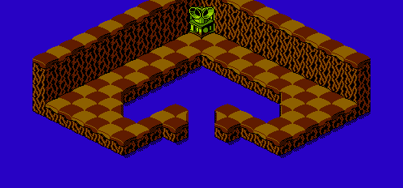

The map data for the bonus map of level 3 is stored in run-length encoding. The data is located starting at address 029E of CHR ROM page 6:

	CHRROM6
	029E	00 21  02 01  01 06  00 09
	02A6	02 01  01 06  00 09  02 01
	02AE	01 03  00 02  01 01  00 09
	02B6	02 01  01 02  00 03  01 02
	02BE	00 08  02 01  01 02  00 03
	02C6	01 01  00 09  02 01  01 02
	02CE	00 06  01 01  00 06  02 01
	02D6	01 02  00 05  01 05  00 03
	02DE	02 01  01 02  00 08  01 02
	02E6	00 03  02 01  01 02  00 08
	02EE	01 02  00 03  02 01  01 02
	02F6	00 07  01 03  00 03  02 01
	02FE	01 0C  00 03  02 01  1E 01
	0306	01 0B  00 03  02 0D  00 12

It decompresses to the following arrangement:

	00 00 00 00 00 00 00 00 00 00 00 00 00 00 00 00
	00 00 00 00 00 00 00 00 00 00 00 00 00 00 00 00
	00 02 01 01 01 01 01 01 00 00 00 00 00 00 00 00
	00 02 01 01 01 01 01 01 00 00 00 00 00 00 00 00
	00 02 01 01 01 00 00 01 00 00 00 00 00 00 00 00
	00 02 01 01 00 00 00 01 01 00 00 00 00 00 00 00
	00 02 01 01 00 00 00 01 00 00 00 00 00 00 00 00
	00 02 01 01 00 00 00 00 00 00 01 00 00 00 00 00
	00 02 01 01 00 00 00 00 00 01 01 01 01 01 00 00
	00 02 01 01 00 00 00 00 00 00 00 00 01 01 00 00
	00 02 01 01 00 00 00 00 00 00 00 00 01 01 00 00
	00 02 01 01 00 00 00 00 00 00 00 01 01 01 00 00
	00 02 01 01 01 01 01 01 01 01 01 01 01 01 00 00
	00 02 1E 01 01 01 01 01 01 01 01 01 01 01 00 00
	00 02 02 02 02 02 02 02 02 02 02 02 02 02 00 00
	00 00 00 00 00 00 00 00 00 00 00 00 00 00 00 00

It appears in-game as the following map:

[Previous](level_2_bonus_map.html)
[Next](level_4_bonus_map.html)
