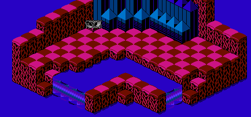

The map data for the bonus map of level 4 is stored in run-length encoding. The data is located starting at address 030E of CHR ROM page 6:

	CHRROM6
	030E	00 02  13 01  3F 02  01 01
	0316	00 0C  13 01  3F 02  04 01
	031E	22 04  04 01  00 07  13 01
	0326	3F 03  22 04  04 01  00 07
	032E	27 01  3F 04  22 03  04 01
	0336	00 07  27 01  3F 04  22 03
	033E	04 01  01 01  00 06  27 01
	0346	3F 04  22 03  04 05  00 03
	034E	27 01  3F 04  22 08  00 03
	0356	27 01  3F 05  22 07  00 03
	035E	27 01  39 01  3F 0B  01 01
	0366	00 03  20 01  6C 01  3F 0A
	036E	04 01  00 04  20 01  6C 01

It decompresses to the following arrangement:

	00 00 13 3F 3F 01 00 00 00 00 00 00 00 00 00 00
	00 00 13 3F 3F 04 22 22 22 22 04 00 00 00 00 00
	00 00 13 3F 3F 3F 22 22 22 22 04 00 00 00 00 00
	00 00 27 3F 3F 3F 3F 22 22 22 04 00 00 00 00 00
	00 00 27 3F 3F 3F 3F 22 22 22 04 01 00 00 00 00
	00 00 27 3F 3F 3F 3F 22 22 22 04 04 04 04 04 00
	00 00 27 3F 3F 3F 3F 22 22 22 22 22 22 22 22 00
	00 00 27 3F 3F 3F 3F 3F 22 22 22 22 22 22 22 00
	00 00 27 39 3F 3F 3F 3F 3F 3F 3F 3F 3F 3F 3F 01
	00 00 00 20 6C 3F 3F 3F 3F 3F 3F 3F 3F 3F 3F 04
	00 00 00 00 20 6C 3F 3F 3F 3F 3F 3F 3F 3F 3F 3F
	00 00 00 00 00 20 6C 3F 3F 3F 3F 3F 3F 3F 3F 3F
	00 00 00 00 00 00 20 6C 6C 6C 6C 3F 3F 3F 3F 3F
	00 00 00 00 00 00 00 20 20 20 20 3F 3F 3F 3F 3F
	00 00 00 00 00 00 00 00 00 42 42 42 13 13 13 13
	00 00 00 00 00 00 00 00 00 00 00 00 00 00 00 00

It appears in-game as the following map:

[Previous](level_3_bonus_map.html)
