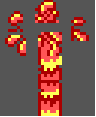

Memory $F3E7 - $F51C gives a list of $9B addresses; these are indexed as $F3E7,X for the low byte and $F482 for the high byte.

These addresses, in turn, point at data which describe how multiple spirtes can be laid out at runtime to form single, larger graphical elements.

The fourth byte in the layout data defines the structure of the data:
* The low nybble gives the number of individual tile definitions that make up the sprite
* If the high nybble is zero, then each tile definition starts with the index of the tile in CHR ROM. If it is eight, then only the first definition gives an index; the subsequent definitions are assumed to use the index, incrementing by one each time.

Each definition in the layout is normally three bytes (modulo index auto-incrementing): the tile index, an X offset, and a Y offset. However, if the third byte of the layout is FF, then each defintion gains another byte that does SOMETHING SOMEHOW RELATED TO SPRITE ORIENTATION.

The table, and the layouts, are as follows:

	00	Snake (north)			F5AB - F5B8	06 00 00 84: [22 01 08 --|-- 03 08 --|-- 00 00 --|-- 04 00 --]
	01	Snake (north, open mouth)	F5B8 - F5C5	06 00 00 84: [26 00 08 --|-- 04 08 --|-- 00 00 --|-- 04 00 --]
	02	Snake (northwest)		F591 - F59E	08 01 00 84: [1A 00 08 --|-- 07 08 --|-- 01 00 --|-- 07 00 --]
	03	Snake (northwest, open mouth)	F59E - F5AB	07 00 00 84: [1E 00 08 --|-- 05 08 --|-- 01 00 --|-- 06 00 --]
	04	Snake (west)			F577 - F584	07 00 00 84: [12 02 09 --|-- 05 09 --|-- 00 01 --|-- 07 01 --]
	05	Snake (west, open mouth)	F584 - F591	08 00 00 84: [16 00 08 --|-- 05 08 --|-- 04 00 --|-- 06 00 --]
	06	Snake (southwest)		F53A - F547	07 00 00 84: [02 01 09 --|-- 06 09 --|-- 00 01 --|-- 06 01 --]
	07	Snake (southwest, mouth open)	F547 - F554	07 01 00 84: [06 00 09 --|-- 07 09 --|-- 06 01 --|-- 07 01 --]
	08	Snake (south)			F55D - F56A	05 02 00 84: [0A 00 08 --|-- 05 08 --|-- 00 00 --|-- 05 00 --]
	09	Snake (south, open mouth)	F56A - F577	05 02 00 84: [0E 00 08 --|-- 04 08 --|-- 00 00 --|-- 04 00 --]
	0A	Jogger pibbly 1			F5FE - F60B	06 03 00 03: [2A 00 00 --|2B 03 01 --|00 02 05 --]
	0B	Jogger pibbly 2			F60B - F615	04 04 00 02: [2C 00 00 --|00 00 05 --]
	0C	Jogger pibbly 3			F615 - F622	07 04 00 03: [2D 00 00 --|2E 05 01 --|00 03 06 --]
	0D	Jogger pibbly 4			F622 - F62F	07 04 00 03: [2F 00 03 --|30 05 00 --|00 03 06 --]
	0E	Jogger pibbly 5			F62F - F639	04 04 00 02: [31 00 00 --|00 00 05 --]
	0F	Jogger pibbly 6			F639 - F646	07 03 00 03: [32 00 03 --|33 04 00 --|00 03 05 --]
	10	Snake (climbing waterfall)	F5F1 - F5FE	05 00 00 84: [C8 00 0E --|-- 04 0E --|   00 06 --|-- 04 06 --]
	11	Nibbly pibbly			F646 - F64D	04 00 00 81: [00 00 01 --]
	12	Bell				D238 - D245	08 03 03 84: [DD 02 08 --|-- 06 08 --|-- 00 00 --|-- 08 00 --]
	13	Nibbly pibbly			F646 - F64D	04 00 00 81: [00 00 01 --]
	14	Disk/sphere/snowball		F64D - F65A	08 02 00 84: [FB 00 08 --|-- 08 08 --|-- 00 00 --|-- 08 00 --]
	15	Lid 1				F65A - F66E	08 05 FF 04: [40 00 08 03|41 00 00 03|40 08 08 43|41 08 00 43]
	16	Lid 2				F66E - F67B	07 05 03 84: [42 01 08 --|-- 06 08 --|-- 00 00 --|-- 04 00 --]
	17	Lid 3				F67B - F687	07 01 FF 02: [46 00 00 03|46 08 00 43]
	18	Snake (north, mouth open)	F5B8 - F5C5	06 00 00 84: [26 00 08 --|-- 04 08 --|-- 00 00 --|-- 04 00 --]
	19	Snake (north, mouth open)	F5B8 - F5C5	06 00 00 84: [26 00 08 --|-- 04 08 --|-- 00 00 --|-- 04 00 --]
	1A	Snake (opening lid 1)		F5C5 - F5D2	07 04 00 84: [47 00 08 --|-- 05 08 --|-- 02 00 --|-- 05 00 --]
	1B	Snake (opening lid 1)		F5C5 - F5D2	07 04 00 84: [47 00 08 --|-- 05 08 --|-- 02 00 --|-- 05 00 --]
	1C	Snake (opening lid 1)		F5C5 - F5D2	07 04 00 84: [47 00 08 --|-- 05 08 --|-- 02 00 --|-- 05 00 --]
	1D	Snake (opening lid 1)		F5C5 - F5D2	07 04 00 84: [47 00 08 --|-- 05 08 --|-- 02 00 --|-- 05 00 --]
	1E	Snake (opening lid 1)		F5C5 - F5D2	07 04 00 84: [47 00 08 --|-- 05 08 --|-- 02 00 --|-- 05 00 --]
	1F	Snake (opening lid 1)		F5C5 - F5D2	07 04 00 84: [47 00 08 --|-- 05 08 --|-- 02 00 --|-- 05 00 --]
	20	Snake (opening lid, south)	F5D2 - F5E6	05 02 FF 04: [4B 00 08 00|4C 04 08 00|4D 01 00 00|4D 05 00 40]
	21	Snake (opening lid, south)	F5D2 - F5E6	05 02 FF 04: [4B 00 08 00|4C 04 08 00|4D 01 00 00|4D 05 00 40]
	22	Pibbly splat			F687 - F693	08 01 FF 02: [91 00 00 00|91 08 00 40]
	23	Pibbly splat			F693 - F69C	08 01 00 82: [92 00 00 --|-- 08 00 --]
	24	Pibbly splat			F69C - F6A5	08 02 00 82: [94 00 00 --|-- 08 00 --]
	25	Pibbly splat			F6A5 - F6AE	08 02 00 82: [96 00 00 --|-- 08 00 --]
	26	Pibbly splat			F6AE - F6B7	08 02 00 82: [98 00 00 --|-- 08 00 --]
	27	Door (closed)			F6B7 - F6C8	0B 04 00 86: [5B 00 10 --|-- 08 10 --|-- 00 08 --|-- 08 08 --|-- 00 00 --|-- 08 00 --]
	28	Door (opening)			F6C8 - F6DE	0B 04 00 06: [5B 00 10 --|5C 08 10 --|5D 00 08 --|61 08 08 --|5F 00 00 --|62 08 00 --]
	29	Door (open)			F6DE - F6F4	0B 04 00 06: [5B 00 10 --|63 08 10 --|5D 00 08 --|64 08 08 --|5F 00 00 --|62 08 00 --]
	2A	Scale marker			F6F4 - F6FB	00 0A 00 01: [65 01 07 --]
	2B	Scale marker (ringing 1)	F6FB - F713	05 0A FF 05: [66 00 18 00|66 0C 18 40|66 00 0A 80|66 0C 0A C0|65 06 07 00]
	2C	Scale marker (ringing 2)	F713 - F72B	07 0A FF 05: [66 00 1A 00|66 10 1A 40|66 00 08 80|66 10 08 C0|65 08 07 00]
	2D	Flying pibbly			F72B - F736	0B 01 00 83: [75 0C 08 --|-- 00 01 --|-- 08 00 --]
	2E	Flying pibbly			F736 - F741	08 09 00 83: [7E 05 08 --|-- 09 08 --|-- 00 00 --]
	2F	Flying pibbly			F741 - F74C	0A 01 00 83: [78 00 07 --|-- 0C 08 --|-- 07 00 --]
	30	Flying pibbly			F74C - F757	07 07 00 83: [7B 01 06 --|-- 09 06 --|-- 00 00 --]
	31	(blank)				F755 - F759	00 00 00 00
	32	Snakedozer (retracted)		F759 - F765	00 00 FF 02: [C3 02 05 00|C3 02 08 C0]
	33	Snakedozer (extending)		F765 - F772	03 00 00 84: [C1 06 08 --|-- 06 00 --|-- 00 00 --|-- 00 08 --]
	34	Snakedozer (extended)		F772 - F781	09 03 00 85: [C3 00 00 --|-- 00 08 --|-- 08 08 --|-- 0C 08 --|-- 08 00 --]
	35	Razorblade (emerging)		F781 - F78C	07 02 00 83: [7A 00 00 --|-- 08 00 --|-- 00 07 --]
	36	Razorblade (extending)		F78C - F799	07 05 00 84: [7C 00 0F --|-- 00 07 --|-- 08 08 --|-- 08 00 --]
	37	Razorblade (extended)		F799 - F7AC	07 01 00 05: [7C 00 10 --|80 00 08 --|7E 08 08 --|81 00 00 --|82 08 00 --]
	38	Splash 1			F7AC - F7B5	07 01 01 82: [89 00 00 --|-- 06 00 --]
	39	Splash 2			F7B5 - F7C6	0A 02 01 86: [83 01 08 --|-- 09 08 --|-- 0D 08 --|-- 00 00 --|-- 08 00 --|-- 0D 00 --]
	3A	Splash 3			F7C6 - F7CD	03 01 01 01: [8B 00 00 --]
	3B	Splash 4			F7CD - F7D4	03 01 01 01: [8C 00 00 --]
	3C	Splash 5			F7D4 - F7E0	07 01 FF 02: [8D 00 00 01|8D 08 00 C1]
	3D	Splash 6			F7E0 - F7EC	07 01 FF 02: [8E 00 00 01|8E 08 00 C1]
	3E	Splash 7			F7EC - F800	09 06 FF 04: [8F 00 08 01|90 08 08 01|90 04 00 C1|8F 0C 00 C1]
	3F	Warp rocket			F800 - F82C	08 03 FF 0A: [79 00 20 01|A8 00 18 01|A8 00 10 01|A8 00 08 01|A9 00 00 02|79 08 20 41|A8 08 18 41|A8 08 10 41|A8 08 08 41|A9 08 00 42]
	40	Warp rocket			F800 - F82C	08 03 FF 0A: [79 00 20 01|A8 00 18 01|A8 00 10 01|A8 00 08 01|A9 00 00 02|79 08 20 41|A8 08 18 41|A8 08 10 41|A8 08 08 41|A9 08 00 42]
	41	Warp rocket			F800 - F82C	08 03 FF 0A: [79 00 20 01|A8 00 18 01|A8 00 10 01|A8 00 08 01|A9 00 00 02|79 08 20 41|A8 08 18 41|A8 08 10 41|A8 08 08 41|A9 08 00 42]
	42	Warp rocket			F800 - F82C	08 03 FF 0A: [79 00 20 01|A8 00 18 01|A8 00 10 01|A8 00 08 01|A9 00 00 02|79 08 20 41|A8 08 18 41|A8 08 10 41|A8 08 08 41|A9 08 00 42]
	43	Warp rocket			F800 - F82C	08 03 FF 0A: [79 00 20 01|A8 00 18 01|A8 00 10 01|A8 00 08 01|A9 00 00 02|79 08 20 41|A8 08 18 41|A8 08 10 41|A8 08 08 41|A9 08 00 42]
	44	Warp rocket			F800 - F82C	08 03 FF 0A: [79 00 20 01|A8 00 18 01|A8 00 10 01|A8 00 08 01|A9 00 00 02|79 08 20 41|A8 08 18 41|A8 08 10 41|A8 08 08 41|A9 08 00 42]
	45	Warp rocket			F800 - F82C	08 03 FF 0A: [79 00 20 01|A8 00 18 01|A8 00 10 01|A8 00 08 01|A9 00 00 02|79 08 20 41|A8 08 18 41|A8 08 10 41|A8 08 08 41|A9 08 00 42]
	46	Warp rocket			F800 - F82C	08 03 FF 0A: [79 00 20 01|A8 00 18 01|A8 00 10 01|A8 00 08 01|A9 00 00 02|79 08 20 41|A8 08 18 41|A8 08 10 41|A8 08 08 41|A9 08 00 42]
	47	Warp rocket			F800 - F82C	08 03 FF 0A: [79 00 20 01|A8 00 18 01|A8 00 10 01|A8 00 08 01|A9 00 00 02|79 08 20 41|A8 08 18 41|A8 08 10 41|A8 08 08 41|A9 08 00 42]
	48	Warp rocket			F800 - F82C	08 03 FF 0A: [79 00 20 01|A8 00 18 01|A8 00 10 01|A8 00 08 01|A9 00 00 02|79 08 20 41|A8 08 18 41|A8 08 10 41|A8 08 08 41|A9 08 00 42]
	49	Warp rocket			F800 - F82C	08 03 FF 0A: [79 00 20 01|A8 00 18 01|A8 00 10 01|A8 00 08 01|A9 00 00 02|79 08 20 41|A8 08 18 41|A8 08 10 41|A8 08 08 41|A9 08 00 42]
	4A	(blank)				F755 - F759	00 00 00 00
	4B	Warp rocket			F800 - F82C	08 03 FF 0A: [79 00 20 01|A8 00 18 01|A8 00 10 01|A8 00 08 01|A9 00 00 02|79 08 20 41|A8 08 18 41|A8 08 10 41|A8 08 08 41|A9 08 00 42]
	4C	Toilet seat 1			F82C - F83B	08 03 00 85: [BD 04 10 --|-- 04 08 --|-- 09 08 --|-- 00 00 --|-- 07 00 --]
	4D	Toilet seat 2			F83B - F848	08 03 00 84: [C2 03 08 --|-- 09 08 --|-- 00 00 --|-- 08 00 --]
	4E	Toilet seat 3			F848 - F857	08 04 00 85: [C6 00 09 --|-- 08 08 --|-- 0A 04 --|-- 00 01 --|-- 08 00 --]
	4F	Toilet seat 4			F857 - F864	08 04 00 84: [CB 01 08 --|-- 09 08 --|-- 01 00 --|-- 09 00 --]
	50	Pin cushion 1			F864 - F86B	05 00 00 01: [CF 00 00 --]
	51	Pin cushion 2			F86B - F872	04 00 00 01: [D0 00 00 --]
	52	Pin cushion 3			F872 - F87B	06 00 00 82: [D1 00 00 --|-- 04 00 --]
	53	Pin cushion 4			F87B - F888	08 02 00 84: [D3 01 08 --|-- 06 08 --|-- 00 00 --|-- 08 00 --]
	54	Bomb				F888 - F898	04 03 FF 03: [F0 02 08 00|F1 02 00 00|F1 00 00 40]
	55	Snake (being eaten?)		F554 - F55D	07 00 00 82: [06 00 02 --|-- 07 02 --]
	56	(BUG?)				DF1A
	57	Mushroom 1			F3C0 - F3CD	08 00 02 84: [A2 00 00 --|-- 08 00 --|-- 00 08 --|-- 08 08 --]
	58	Mushroom 2			F3CD - F3DA	08 01 02 84: [A4 00 08 --|-- 08 08 --|-- 00 00 --|-- 08 00 --]
	59	Anvil				F3DA - F3E7	07 03 00 84: [75 00 09 --|-- 08 08 --|-- 00 01 --|-- 07 00 --]
	5A	Bomb				F888 - F898	04 03 FF 03: [F0 02 08 00|F1 02 00 00|F1 00 00 40]
	5B	Explosion			F898 - F89F	03 00 00 01: [E2 00 00 --]
	5C	Explosion			F89F - F8AC	07 02 00 84: [E3 03 08 --|-- 06 08 --|-- 00 00 --|-- 08 00 --]
	5D	Explosion			F8AC - F8C1	0B 0B 00 88: [E7 0C 18 --|-- 01 10 --|-- 09 10 --|-- 0F 10 --|-- 00 08 --|-- 08 08 --|-- 10 08 --|-- 10 00 --]
	5E	Disk/sphere/snowball 2		D22B - D238	07 02 00 84: [FB 00 08 --|-- 08 08 --|-- 00 00 --|-- 08 00 --]
	5F	Flag 1				F8C1 - F8CE	02 00 01 84: [DE 00 08 --|-- 08 08 --|-- 00 00 --|-- 08 00 --]
	60	(dynamic, purpose unknow)	06A0
	61	(dynamic, purpose unknow)	06EC
	62	Flag 1				F8C1 - F8CE	02 00 01 84: [DE 00 08 --|-- 08 08 --|-- 00 00 --|-- 08 00 --]
	63	Flag 2				F8CE - F8DB	02 00 01 03: [44 00 08 --|45 08 05 --|5A 00 00 --]
	64	Bigfoot				F8DB - F8EE	09 03 01 05: [F3 00 08 --|F4 03 08 --|F5 00 00 --|F6 08 00 --|DC 10 00 --]
	65	Bigfoot				F8DB - F8EE	09 03 01 05: [F3 00 08 --|F4 03 08 --|F5 00 00 --|F6 08 00 --|DC 10 00 --]
	66	Bigfoot				F8DB - F8EE	09 03 01 05: [F3 00 08 --|F4 03 08 --|F5 00 00 --|F6 08 00 --|DC 10 00 --]
	67	Bigfoot				F8DB - F8EE	09 03 01 05: [F3 00 08 --|F4 03 08 --|F5 00 00 --|F6 08 00 --|DC 10 00 --]
	68	Snake (hurt) 1			F8F5 - F902	05 04 00 84: [AE 00 08 --|-- 04 08 --|-- 00 00 --|-- 04 00 --]
	69	Snake (hurt) 2			F902 - F90F	0C 03 00 84: [B2 03 08 --|-- 08 08 --|-- 00 00 --|-- 08 00 --]
	6A	Poof				F8EE - F8F5	04 00 00 01: [F2 00 01 --]
	6B	Poof				F8EE - F8F5	04 00 00 01: [F2 00 01 --]
	6C	Poof				F8EE - F8F5	04 00 00 01: [F2 00 01 --]
	6D	Extra time			9E62 - 9E6F	06 00 02 84: [AA 00 09 --|-- 06 09 --|-- 00 01 --|-- 06 01 --]
	6E	Fish tail			9E57 - 9E62	0A 00 02 83: [D4 08 0A --|-- 00 06 --|-- 08 02 --]
	6F	Extra continue			F547 - F554	07 01 00 84: [06 00 09 --|-- 07 09 --|-- 06 01 --|-- 07 01 --]
	70	Tongue extender			D222 - D22B	04 00 00 82: [DA 00 08 --|-- 00 00 --]
	71	Invisibility diamond		F90F - F91A	07 04 01 83: [53 00 08 --|-- 05 08 --|-- 02 00 --]
	72	Extra life			F91A - F924	06 00 00 02: [51 00 02 --|BC 03 02 --]
	73	Control inverter		F924 - F930	04 00 FF 02: [52 00 03 80|52 00 02 00]
	74	Windup Key			F930 - F93B	07 03 01 83: [56 00 08 --|-- 06 08 --|-- 03 00 --]
	75	100				F93B - F948	0B 02 00 03: [34 0E 00 --|34 07 00 --|35 00 00 --]
	76	200				F948 - F955	0B 02 00 03: [36 00 00 --|34 07 00 --|34 0E 00 --]
	77	300				F955 - F962	0B 02 00 03: [37 00 00 --|34 07 00 --|34 0E 00 --]
	78	750				F962 - F96F	0B 02 00 03: [3B 00 00 --|39 07 00 --|34 0E 00 --]
	79	500				F96F - F97C	0B 02 00 03: [39 00 00 --|34 07 00 --|34 0E 00 --]
	7A	150				F97C - F989	0B 02 00 03: [35 00 00 --|39 07 00 --|34 0E 00 --]
	7B	1000				F989 - F999	0E 02 00 04: [34 16 00 --|34 0E 00 --|34 07 00 --|35 00 00 --]
	7C	5000				F999 - F9A9	0E 02 00 04: [34 16 00 --|34 0E 00 --|34 07 00 --|39 00 00 --]
	7D	Snake (squished)		F5E6 - F5F1	07 0E 00 83: [F8 00 08 --|-- 08 08 --|-- 08 00 --]
	7E	Pibblyfish 1			F9A9 - F9B6	03 05 00 84: [30 00 08 --|-- 04 08 --|-- 00 00 --|-- 04 00 --]
	7F	Pibblyfish 2			F9B6 - F9C1	03 05 00 83: [2A 00 04 --|-- 02 08 --|-- 02 00 --]
	80	Pibblyfish 3			F9C1 - F9CC	03 05 00 83: [2D 00 08 --|-- 00 00 --|-- 05 04 --]
	81	Pibblyspring 1			F9CC - F9D6	04 07 00 02: [D7 00 03 --|00 00 07 --]
	82	Pibblyspring 2			F9D6 - F9E0	04 05 00 02: [D8 00 00 --|00 00 07 --]
	83	Pibblyspring 3			F9E0 - F9EA	04 03 00 02: [D9 00 00 --|00 00 07 --]
	84	Pibblycopter 1			F9EA - F9F4	04 01 00 02: [00 00 00 --|2A 00 08 --]
	85	Pibblycopter 2			F9F4 - F9FE	04 01 00 02: [00 00 00 --|2B 00 08 --]
	86	Pibblycopter 3			F9FE - FA0A	04 01 FF 02: [00 00 00 00|2A 00 08 40]
	87	Portrait frame (northeast)	FA0A - FA1B	00 00 41 86: [BC 00 20 --|-- 08 1C --|-- 10 18 --|-- 13 10 --|-- 14 08 --|-- 14 00 --]
	88	Portrait frame (southeast)	FA1B - FA2F	00 1B FF 85: [BC 00 00 C1|-- 08 04 C1|-- 10 08 C1|-- 13 10 C1|-- 14 18 C1]
	89	Jaws (teeth)			DE12 - DE26	10 04 FF 04: [69 00 01 01|6A 08 00 01|6A 10 00 41|69 18 01 41]
	8A	Jaws (shadow)			DE26 - DE42	0C 04 FF 06: [67 00 05 01|68 08 05 01|67 00 00 81|68 08 00 81|67 0F 05 41|67 0F 00 C1]
	8B	Jaws (mouth closing)		DED2 - DEF6	10 04 FF 08: [6B 00 08 01|6C 08 08 01|6D 00 00 01|6E 08 00 01|6B 18 08 41|6C 10 08 41|6D 18 00 41|6E 10 00 41]
	8C	Jaws (mouth closed)		DEF6 - DF1A	10 04 FF 08: [6F 00 08 01|70 08 08 01|71 00 00 01|72 08 00 01|6F 18 08 41|70 10 08 41|71 18 00 41|72 10 00 41]
	8D	Magic carpet 1			D16A - D17B	0F 0F 00 86: [67 00 05 --|-- 08 08 --|-- 10 08 --|-- 18 03 --|-- 08 00 --|-- 10 00 --]
	8E	Magic carpet 2			D17B - D18C	0F 0F 00 86: [6D 00 04 --|-- 08 08 --|-- 10 08 --|-- 18 05 --|-- 08 00 --|-- 10 00 --]
	8F	Water jet 1			D18C - D19D	0D 00 01 86: [A4 00 10 --|-- 0A 10 --|-- 14 0D --|-- 01 08 --|-- 0A 08 --|-- 0A 00 --]
	90	Water jet 1			D18C - D19D	0D 00 01 86: [A4 00 10 --|-- 0A 10 --|-- 14 0D --|-- 01 08 --|-- 0A 08 --|-- 0A 00 --]
	91	Water jet 2			D19D - D1B6	0B 00 01 07: [A4 00 18 --|A5 08 18 --|A6 10 15 --|A7 00 10 --|A8 08 10 --|A9 08 08 --|A2 08 00 --]
	92	Water jet 3			D1B6 - D1D2	10 00 01 08: [A4 00 1C --|A5 0C 1F --|A6 18 19 --|A7 01 13 --|A8 0D 14 --|A9 0D 0C --|A2 0D 04 --|A3 0D 00 --]
	93	Tree 1				CF63 - CF6A	04 02 03 01: [99 00 00 --]
	94	Tree 2				9E6F - 9E79	04 05 03 02: [98 00 00 --|91 00 08 --]
	95	Tree 3				9E79 - 9E86	06 02 03 03: [91 02 08 --|96 00 00 --|97 03 00 --]
	96	Tree 4				9E86 - 9E95	07 05 03 85: [91 03 10 --|-- 01 08 --|-- 04 08 --|-- 00 00 --|-- 05 00 --]
	97	Ice cube			AF0A - AF17	07 04 00 84: [30 00 08 --|-- 08 08 --|-- 00 00 --|-- 08 00 --]
	98	Ice cube 2			AF17 - AF24	05 03 00 84: [2C 00 08 --|-- 04 08 --|-- 00 00 --|-- 04 00 --]
	99	Bubble				AF24 - AF31	08 02 03 84: [40 00 08 --|-- 08 08 --|-- 00 00 --|-- 08 00 --]
	9A	Icy pibbly hole			AF31 - AF3D	04 07 FF 02: [46 00 08 00|46 00 00 80]

|Index|Address|ChrRom 1|ChrRom 4|ChrRom 5|
|---|---|:---:|:---:|:---:|
|00|F5AB||||
|01,18,19|F5B8||||
|02|F591||||
|03|F59E||||
|04|F577||||
|05|F584||||
|06|F53A||||
|07,6F|F547||||
|08|F55D||||
|09|F56A||||
|1A-1F|F5C5||||
|20,21|F5D2||||
|55|F554||||
|68|F8F5||||
|69|F902||||
|7D|F5E6||||
|10|F5F1||||
|27|F6B7||||
|28|F6C8||||
|29|F6DE||||
|11,13|F646||||
|2A|F6F4||||
|2B|F6FB||||
|2C|F713||||
|54,5A|F888||||
|5B|F898||||
|5C|F89F||||
|5D|F8AC||||
|6A-6C|F8EE||||
|6D|9E62||||
|70|D222||||
|71|F90F||||
|72|F91A||||
|73|F924||||
|75|F93B||||
|76|F948||||
|77|F955||||
|78|F962||||
|79|F96F||||
|7A|F97C||||
|7B|F989||||
|7C|F999||||
|14|F64D||||
|5E|D22B||||
|64-67|F8DB||||
|81|F9CC||||
|82|F9D6||||
|83|F9E0||||
|0A|F5FE||||
|0B|F60B||||
|0C|F615||||
|0D|F622||||
|0E|F62F||||
|0F|F639||||
|22|F687||||
|23|F693||||
|24|F69C||||
|25|F6A5||||
|26|F6AE||||
|35|F781||||
|36|F78C||||
|37|F799||||
|3F-49,4B|F800||||
|4C|F82C||||
|4D|F83B||||
|4E|F848||||
|4F|F857||||
|50|F864||||
|51|F86B||||
|52|F872||||
|53|F87B||||
|57|F3C0||||
|58|F3CD||||
|59|F3DA||||
|89|DE12||||
|8A|DE26||||
|8B|DED2||||
|8C|DEF6||||
|15|F65A||||
|16|F66E||||
|17|F67B||||
|38|F7AC||||
|39|F7B5||||
|3A|F7C6||||
|3B|F7CD||||
|3C|F7D4||||
|3D|F7E0||||
|3E|F7EC||||
|74|F930||||
|2D|F72B||||
|2E|F736||||
|2F|F741||||
|30|F74C||||
|7E|F9A9||||
|7F|F9B6||||
|80|F9C1||||
|12|D238||||
|32|F759||||
|33|F765||||
|34|F772||||
|93|CF63||||
|94|9E6F||||
|95|9E79||||
|96|9E86||||
|6E|9E57||||
|8D|D16A||||
|8E|D17B||||
|8F,90|D18C||||
|91|D19D||||
|92|D1B6||||
|5F,62|F8C1||||
|63|F8CE||||
|60|06A0||||
|61|06EC||||
|84|F9EA||||
|85|F9F4||||
|86|F9FE||||
|97|AF0A||||
|98|AF17||||
|99|AF24||||
|9A|AF31||||

|Index|Address|Image|Notes|
|---|---|:---:|---|
|31,4A|F755||blank|
|56|DF1A||invalid|
|87|FA0A||on page 7|
|88|FA1B||on page 7|
